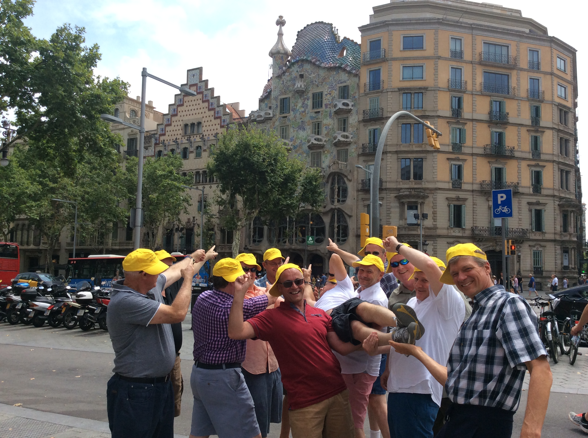
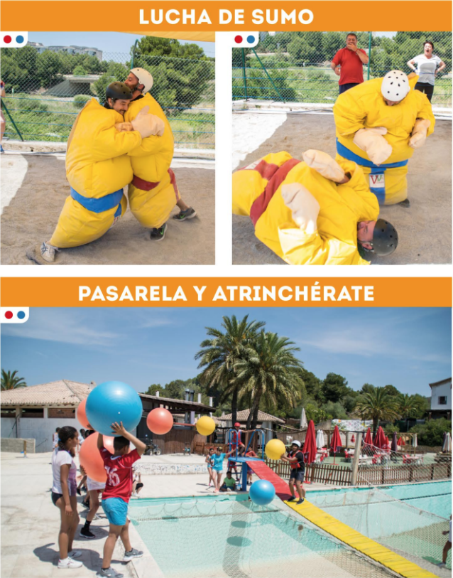
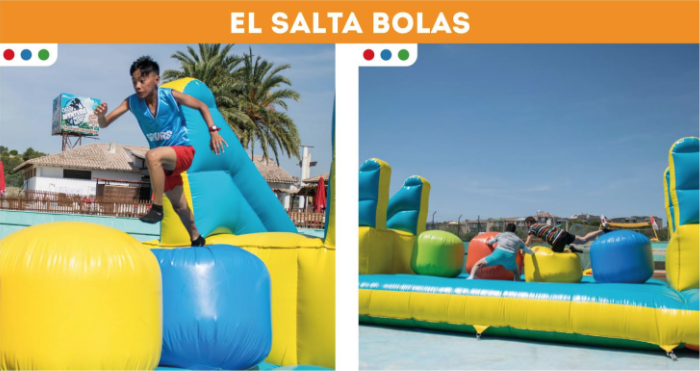
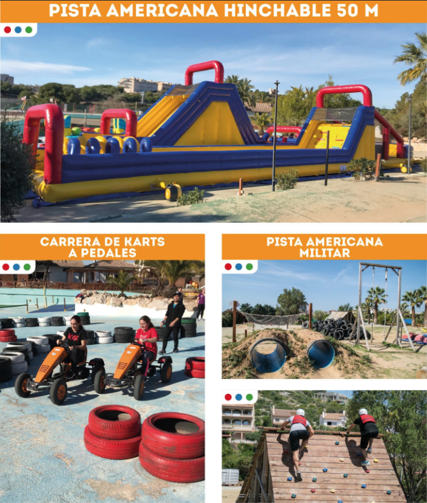
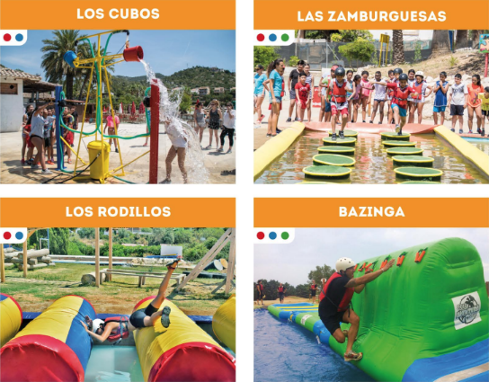

<script> 
    $(document).ready(function() { 
    $head = $('#header'); 
    $head.prepend('<A href = https://www.cuttingedge-events.com></A>') 
    }); 
</script> 


```{r setup, include=FALSE}
knitr::opts_chunk$set(echo = FALSE, message=FALSE, warning=FALSE)
```


```{r libraries}
library(readxl)
library(dplyr)
library(knitr)
library(timevis)

```


## iPad Treasure Hunt

This is a customized activity that we created specially for each client. 
We will split them in 5 teams of 10 pax. Each team will have an iPad and a bag with city maps and some extra materials that they will need during the activity.

Before start the race, we will do a briefing explaining the instructions to the captians. Each group will have to choose its own strategy to win. They will need to pass different kind of challenges (we can include special challenges related with the client's company). 

We will create a website with the instructions, maps, etc and they will have to use their iPad to take the pictures and videos. 

The starting and ending spot will be customized depending on the client's needs.

The teams will find the challenges around the old town (Born and Gothic Quarters), so it will be a walking activity.

* **Location** Barcelona
* **Duration** From 3 to 4 hours   
* **Capacity** from 20 to 200 pax
* **Included** iPad rental (5 in total), activity design and organization, material needed and an award for the winner team.

The organization will give to the tour-leader the award for the winner team.
The results, pictures and videos will be sent to the tour-leader after  4 hours.

An edited video (including pictures and videos) will be sent one week after the activity.





<iframe src="https://player.vimeo.com/video/204382207" width="100%" height="550" frameborder="0" allow="autoplay; fullscreen" allowfullscreen></iframe>


### Rates & Conditions

    Basic activity: 30€ per pax VAT inc (for a minimum of 50 pax)
  
    Net rates for B Destination Services
  
    Extras:
    
      * Public transportation cards (10 oneway trips): 15€ per card - we suggest to add 2 per team, so 10 in total
      * Bottle of water: 1,5€ per bottle
      * Drink tickets - we will give them 1 ticket per person to have a drink in a set bar (they will have the instruction and everything in the iPad) - 8€ VAT inc per person
  
  
   
* Cutting Edge Events needs 2 weeks to create the website and prepare the activity, so it is mandatory to contract the activity before October 4th, 2019.
  
*****

## Takeshi's Castle Challenge

Located in Sitges we find this funny Parc with more than 59000m2

Takeshi's Castle Challenge is a competition. We will split guests in teams that will have to pass different challenges based on the legendary TV show.









### Rates & Conditions

    Activity: 30€ per pax VAT inc (for a minimum of 50 pax)
    Net rates for B Destination Services
    
    Included: English speaking instructors, changing rooms, showers, lockers (they ask 5€ deposit that is refunded) and basic insurance
    
    Not included: transfer, drinks or food

